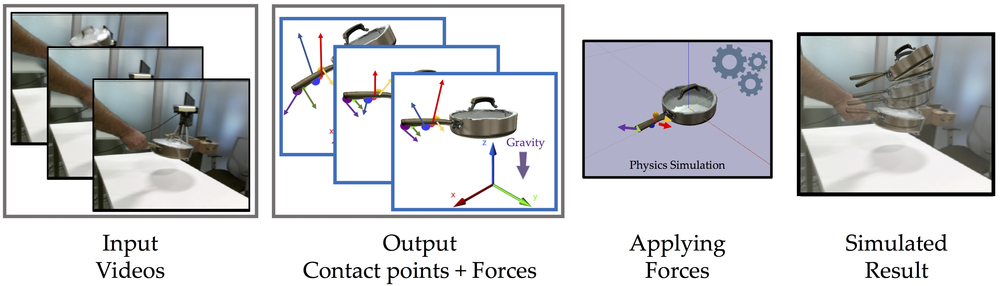

# [Use the Force Luke! Learning to Predict Physical Forces by Simulating Effects](https://arxiv.org/pdf/2003.12045.pdf)
## K Ehsani, S Tulsiani, S Gupta, A Farhadi, A Gupta
This project is an oral presentation at CVPR2020.

[(Project Page)](https://ehsanik.github.io/forcecvpr2020/) [(PDF)](https://arxiv.org/pdf/2003.12045.pdf) [(Slides)](https://github.com/ehsanik/forcecvpr2020/blob/master/img/3095-talk.pdf) [(Video)](https://ehsanik.github.io/forcecvpr2020/#slide_video)

<center></center>

### Abstract

When we humans look at a video of human-object interaction, we can not only infer what is happening but we can even extract actionable information and imitate those interactions. On the other hand, current recognition or geometric approaches lack the physicality of action representation. In this paper, we take a step towards a more physical understanding of actions. We address the problem of inferring contact points and the physical forces from videos of humans interacting with objects. One of the main challenges in tackling this problem is obtaining ground-truth labels for forces. We sidestep this problem by instead using a physics simulator for supervision. Specifically, we use a simulator to predict effects and enforce that estimated forces must lead to the same effect as depicted in the video.

Our quantitative and qualitative results show that:
<ol>
    <li>We can predict meaningful forces from videos whose effects lead to accurate imitation of the motions observe.</li>
    <li>By jointly optimizing for contact point and force prediction, we can improve the performance on both tasks in comparison to independent training. </li>
    <li>We can learn a representation from this model that generalizes to novel objects using few shot examples. </li>
</ol>


### Installation
1. Install requirements:

```
pip3 install -r requirements.txt
```

2. Clone the repository using the command:

```
git clone https://github.com/ehsanik/touchTorch
cd touchTorch
```

3. Download the dataset from [here](https://drive.google.com/file/d/1fs-L0PSxHhY22Q-SBHG-bnmdUWTR90-c/view?usp=sharing) and extract it to DatasetForce.
4. Download pretrained weights from [here](https://drive.google.com/file/d/1JNTkWJX0EmdzXx6A18A7lFq1tiDuLlgE/view?usp=sharing) and extract it to "DatasetForce/trained_weights". 


### Dataset

Dataset statistics is provided in the paper. The structure of the dataset is as follows:

```
DatasetForce
└── images
│   └── OBJECTNAME
│       └── image_*.jpeg
└── annotations
│   ├── [test/train/val]_time_to_clip_ind.json
│   ├── [test/train/val]_cleaned_start_states.json
│   ├── time_to_keypoint_fps_{FPS}.json
│   ├── time_to_obj_state_fps_{FPS}.json
│   └── clean_clip_to_contact_point.json
└── trained_weights
│   └── *.pytar
└── objects_16k  -----  YCB objects modified for PyBullet
    └── OBJECTNAME
        └── google_16k
            ├── textured.urdf  -----  URDF to load in PyBullet
            ├── textured_big.obj  -----  Object mesh
            ├── textured_big.obj.mtl  -----  Corresponding texture
            ├── textured_bigconvex.obj  -----  Simplified mesh for collision 
            │                                   (Calculated using [v-hacd])
            └── *_keypoints.json  -----  Keypoints on the object mesh
```
### Train

To train your own model:

```
python3 main.py --title joint_training --sequence_length 10 --gpu-ids 0 --number_of_cp 5 \
   --model SeparateTowerModel --dataset DatasetWAugmentation --loss KPProjectionCPPredictionLoss \ 
   --object_list ALL --data DatasetForce
```

See `scripts/train_scripts.sh` for additional training scripts.

### Test

To test using the pretrained model and reproduce the results in the paper:

```
python3 main.py --title test_all_joint_training --sequence_length 10 --gpu-ids 0 \ 
   --number_of_cp 5 --model SeparateTowerModel --dataset DatasetWAugmentation \
   --loss KPProjectionCPPredictionLoss --object_list ALL --data DatasetForce \
   --reload DatasetForce/trained_weights/all_obj_end2end.pytar test
```

See `scripts/test_w_weights.sh` for additional scripts.


### Citation

If you find this project useful in your research, please consider citing:

```
   @inproceedings{ehsani2020force,
     title={Use the Force, Luke! Learning to Predict Physical Forces by Simulating Effects},
      author={Ehsani, Kiana and Tulsiani, Shubham and Gupta, Saurabh and Farhadi, Ali and Gupta, Abhinav},
     booktitle={CVPR},
     year={2020}
   }
```
